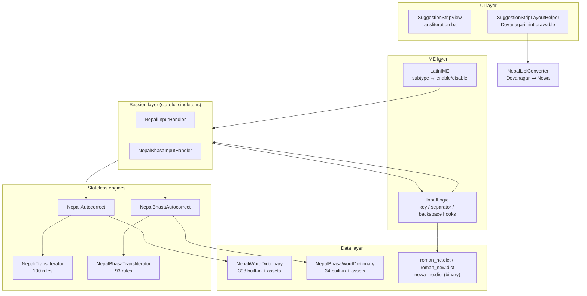
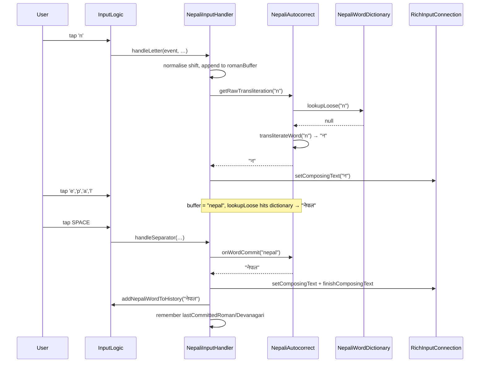

# Roman → Devanagari / Newa Transliteration

Feature documentation for the Nepali (`ne-NP`) and Nepal Bhasa / Newar (`new-NP`)
transliteration input modes added on the `newa` branch.

- **Status:** implemented, unit-tested, not yet upstreamed
- **Entry points:** two IME subtypes (`0x5fafea35`, `0x5fafea42`)
- **Scope:** input logic, transliteration engines, word dictionaries, suggestion strip UI, settings

---

## 1. What the feature does

The user types **Roman letters on a QWERTY layout** and sees **Devanagari** (Nepali)
or **Newa / Nepal Lipi** (Nepal Bhasa) appear in the text field as they type.

```
type:  n  e  p  a  l          →  committed: नेपाल
type:  n  e  w  a             →  committed: 𑐣𑐾𑐰𑐵
```

Three things happen on every keystroke:

1. The Roman letter is appended to an in-memory **roman buffer**.
2. The whole buffer is re-transliterated into a **live preview** set as the composing text.
3. A **suggestion list** is rebuilt from the transliteration + word dictionary + the
   compiled `.dict` binary dictionary.

On a separator (space/punctuation) the word is committed, added to the user-history
dictionary, and remembered so that a backspace can restore composing state (recorrection).

### User-visible surfaces

| Surface | Where | Notes |
|---|---|---|
| Transliteration bar | Above the suggestion strip | Shows `roman → script`. Toggle: **Settings → Preferences → Show transliteration bar** (default on) |
| Help dialog | `?` button on the transliteration bar | Full mapping cheat-sheet, per-language |
| Devanagari hints | Below each Newa suggestion word | Newa keyboard only. Toggle: **Show Nepali hints** (default on) |
| Suggestion strip | Standard strip | Reordered so autocorrect target is index 1 when autocorrect is ON |

---

## 2. Architecture

### 2.1 Layer map



### 2.2 Responsibility split

| Component | State | Responsibility |
|---|---|---|
| `NepaliTransliterator` / `NepalBhasaTransliterator` | stateless | Pure Roman → script string conversion. Longest-match-first rule table. |
| `NepaliWordDictionary` / `NepalBhasaWordDictionary` | mutable singleton | Built-in map + asset file + runtime-learned words, with frequencies. |
| `NepaliAutocorrect` / `NepalBhasaAutocorrect` | stateless | Composes transliterator + dictionary into "best word" and "suggestion list". |
| `NepaliInputHandler` / `NepalBhasaInputHandler` | **mutable singleton** | Owns the roman buffer, preview, and last-committed word. Builds `SuggestedWords`. |
| `NepalLipiConverter` | stateless | Script conversion (Devanagari ⇄ Newa), used only for display hints. |

---

## 3. Key press → committed word



### Backspace / recorrection

`handleBackspace` has two modes:

- **Composing** — pop one Roman character, re-transliterate, update composing text.
- **Not composing, but a word was just committed** — delete the committed word (with or
  without its trailing space), restore the Roman buffer, and re-enter composing state.
  This is what makes "space, oops, backspace" round-trip back to editable Roman.

`tryRestoreFromCursorTap` does the same thing when the user taps the cursor into the
last committed word.

---

## 4. Transliteration engine

Both transliterators share one algorithm; only the rule table and virama codepoint differ.

### Algorithm

1. Scan the input left to right.
2. At each position, take the **first matching rule in declaration order**. The table is
   hand-ordered longest-first, so `chh` wins over `ch` wins over `c`.
3. Emit per rule type:

| Type | Rule |
|---|---|
| `CONSONANT` | If the previous emit was a consonant, insert a **virama** (`्` / `𑑂`) first, then the consonant glyph. |
| `VOWEL` | After a consonant → emit the **matra** (dependent form); an inherent `a` emits nothing. Otherwise emit the **independent** vowel glyph. |
| `DIACRITIC` | Emit as-is (anusvara, visarga, chandrabindu, explicit virama). |

4. Unmatched characters (digits, punctuation, already-Devanagari text) pass through unchanged.

```
"nepal"   → न + े + प + ा + ल   → नेपाल
"kt"      → क + ् + त           → क्त      (implicit virama)
"aa"      → आ                    (independent, no preceding consonant)
"kaa"     → क + ा  → का          (matra form)
```

### Capitalisation is phonetic, not cosmetic

Uppercase is meaningful for a subset of letters and must survive Android's auto-shift at
the start of a sentence. `MEANINGFUL_UPPERCASE` guards this:

```
T→ट  D→ड  N→ण          retroflex series
A→आ  I→ई  U→ऊ  E→ऐ  O→औ  R→ऋ   long vowels / shortcuts
M→ं  H→ः                diacritics
C→छ (Ch)  S→ष (Sh)      digraph starters distinct from lowercase
F X Z Q B L             shortcut keys (फ क्ष ज्ञ क्व भ ळ)
```

Everything else (`K G J P Y V W`) is normalised to lowercase. `handleLetter` additionally
checks `inputTransaction.shiftState` against `CapsMode.AUTO` / `CapsMode.AUTO_LOCKED`, so a
sentence-initial `T` still yields `ट`, not `त`.

---

## 5. Dictionary and "loose" matching

The dictionary layer is what turns *phonetically correct but wrong* output into the
spelling users expect:

```
strict transliteration:  "nepal" → नेपल
dictionary (loose):      "nepal" → नेपाल   ✅
```

### Lookup order

```
lookupLoose(roman)
  ├── 1. exact:            fileWordMap → builtInWordMap  (lowercased, then raw)
  ├── 2. a → aa variant:   "nepal" → "nepaal"
  └── 3. aa → a variant:   "nepaal" → "nepal"
```

### Sources, in priority order

| Source | Nepali | Nepal Bhasa | Persisted |
|---|---|---|---|
| Runtime-learned (`addWord`) | ✅ | ✅ | ❌ — see §8 |
| Asset file | `assets/nepali_words.txt` | `assets/nepal_bhasa_words.txt` | ships with APK |
| Built-in map | 398 entries | 34 entries | compiled in |
| Binary `.dict` | `roman_ne.dict`, `newa_ne.dict` | `roman_new.dict` | compiled in |

Asset file format (`:frequency` optional, default 150):

```
# comment
nepal=नेपाल
pratigya=प्रतिज्ञा
kathmandu=काठमाडौं:230
```

### Frequencies

`builtInFrequencies` assigns per-word scores (200–250 for particles, verbs and greetings);
everything else falls back to 100. These scores drive suggestion ordering — they are
**not** the AOSP dictionary frequencies and never reach the native engine.

---

## 6. Suggestion strip composition

`buildSuggestedWords` produces a different order depending on the autocorrect setting.

**Autocorrect ON, and a dictionary match exists that differs from the raw transliteration:**

| Index | Content | Kind |
|---|---|---|
| 0 | raw transliteration (what the user literally typed) | `KIND_TYPED`, `MAX_SCORE` |
| 1 | dictionary match — **this is what commits on space** | `KIND_CORRECTION` |
| 2… | prefix matches from our dictionary, by frequency desc | `KIND_COMPLETION` |
| …9 | extras from `roman_ne.dict` / `roman_new.dict` | `KIND_COMPLETION`, score 0 |
| last | the raw Roman word, so it can be committed unchanged | `KIND_COMPLETION` |

**Autocorrect OFF (or no dictionary match):** index 0 is the best word (dictionary match if
any, else raw transliteration); the rest follows the same tail.

Suggestions sourced from the dictionary use `DICTIONARY_HARDCODED`, which is what makes
long-press show the delete affordance.

### Glide typing

The glide (gesture) library only understands Latin. The pipeline therefore keeps gestures
in Roman and converts at the boundary:

- `buildDevanagariPreviewWords` / `buildNewaPreviewWords` convert an entire
  `SuggestedWords` from Roman to script for the floating preview and the strip.
  They short-circuit if the top word already contains script characters.
- `translateGestureWord` converts the finally-chosen batch word.
- `ScriptUtils.script()` reports `SCRIPT_LATIN` for `ne`/`new` while a handler is active,
  so proximity/gesture matching runs against the Latin key grid.

---

## 7. Wiring and configuration

### Subtypes (`res/xml/method.xml`)

| Subtype ID | Locale | Layout | Behaviour |
|---|---|---|---|
| `0x5fafea35` | `ne_NP` | QWERTY (AsciiCapable) | **Nepali transliteration** |
| `0x5fafea42` | `new_NP` | QWERTY (AsciiCapable) | **Nepal Bhasa transliteration** |
| `0x5fafea88` | `ne_NP` | `nepali_traditional` | direct Devanagari input |
| `0xd80a4cee` | `ne_NP` | `nepali_romanized` | direct, romanized key arrangement |
| `0x5fafea87` | `new_NP` | `nepalbhasa_traditional` | direct Newa input |

`LatinIME.initTransliteration()` matches `subtype.hashCode()` against the two
transliteration IDs, loads the matching asset dictionary, enables one handler and disables
the other. Any other subtype disables both.

> **Note:** activation is keyed on the hard-coded subtype hash. Changing any attribute of
> those two `<subtype>` elements changes the hash and silently disables the feature.

### Settings

| Key | Default | Effect |
|---|---|---|
| `show_transliteration_bar` | `true` | Show the `roman → script` bar above the strip |
| `show_nepali_hints` | `true` | Show Devanagari hints under Newa suggestions |

The bar stays mounted (empty when idle) while a handler is active, so the keyboard height
never shifts mid-typing.

### Integration points in existing code

| File | Change |
|---|---|
| `LatinIME.java` | subtype detection, dictionary availability override, bar updates, help dialog |
| `InputLogic.java` | letter / separator / backspace / suggestion-pick hooks; `addNepaliWordToHistory`, `getNepaliDictSuggestions` |
| `ScriptUtils.kt` | report `SCRIPT_LATIN` for `ne`/`new` while transliterating |
| `SuggestionStripView.kt` | transliteration bar view, help button |
| `SuggestionStripLayoutHelper.java` | Devanagari hint drawable under Newa words |
| `KeyboardView.java` | Devanagari hint rendering on Newa keys (`mShowNepaliHints`) |
| `spellchecker.xml` | `ne` and `new` spell-checker subtypes |

---

## 8. Known gaps and risks

Ordered by impact. These are real, verified against the current tree.

### 8.1 Nepal Bhasa asset dictionary — **PARTLY FIXED**

`LatinIME.initTransliteration()` loaded `nepal_bhasa_words.txt`, which did not exist. The
loader swallowed the `FileNotFoundException`, logged a warning and latched
`isFileLoaded = true`, so the failure was silent and permanent for the process.

**Fixed:** `app/src/main/assets/nepal_bhasa_words.txt` now ships, so the load succeeds and
there is a documented place to add vocabulary without a code change.

**Still outstanding:** the file has no entries, so Nepal Bhasa still runs on the ~34-entry
built-in map. Populating it needs a Nepal Bhasa speaker — both the romanisation scheme and
the orthography are human decisions (see §8.7). This was a broken mechanism *and* missing
data; only the mechanism is fixed.

### 8.2 Learned words are never persisted — **FIXED**

`learnWord()` → `addWord()` wrote to the in-memory `fileWordMap` only;
`saveToInternalStorage()` had no caller, `loadFromInternalStorage()` was commented out, and
`NepalBhasaWordDictionary` had no persistence functions at all.

Fixed, and the storage model was corrected along the way:

- User-learned words now live in a separate `userWordMap` / `userFrequencies`. Previously
  `addWord` wrote into `fileWordMap`, so saving would have copied the entire shipped asset
  into internal storage as if the user had typed it.
- Lookup precedence is user → asset → built-in.
- `saveToInternalStorage` writes only user words, and now round-trips the frequency
  (`roman=script:freq`) that the loader was already able to parse. It also no longer writes
  a "Nepal Bhasa" header into the *Nepali* file.
- `saveIfDirty()` writes only when something was actually learned. `LatinIME` calls it from
  `cleanupInternalStateForFinishInput()` and `onDestroy()`.
- `loadFromInternalStorage` is wired for both languages in `initTransliteration()`.
- `NepalBhasaWordDictionary` gained the whole save/load pair it was missing.

### 8.3 Per-keystroke allocation in suggestion building — **FIXED**

Three things ran on every keystroke:

- `getPrefixMatchesWithFrequency()` copied the whole built-in map, then merged the asset map
  into the copy.
- Its comparator called `getFrequency()` inside `sortedWith`, so an n-candidate prefix match
  did O(n log n) map lookups.
- `findMatch()` scanned all ~100 transliteration rules per input position, and the entire
  buffer was re-transliterated from scratch each key.

Fixed:

- `mergedCache` holds the union of built-in + asset + user words, rebuilt only when a source
  changes (`invalidateMerged()` on asset load, user load, `addWord`, `removeWord`).
- Frequency is resolved once per candidate before the sort instead of twice per comparison.
- The rule table is indexed by first character (`mappingsByFirstChar`). A rule can only match
  where `input[pos] == rule.roman[0]`, and `groupBy` is stable, so the hand-ordered
  longest-match-first semantics are preserved exactly. Worst bucket is 6 rules, against 100
  scanned before.

Still open: the buffer is re-transliterated in full on each keystroke rather than
incrementally. Left alone — words are short and the rule scan is no longer the cost.

### 8.4 The two handlers are near-duplicates — **MEDIUM (maintainability)**

`NepaliInputHandler` (378 lines) and `NepalBhasaInputHandler` (358 lines) are structurally
identical; the same is true of the two `*Autocorrect`, `*WordDictionary` and
`*Transliterator` pairs. Every call site in `InputLogic.java` and `LatinIME.java` is
duplicated as a paired `if` block — roughly ten of them.

Adding a third script means touching every one of those sites again. The natural
refactor is a `TransliterationEngine` interface with a per-language rule table and
dictionary, plus a single `activeEngine: TransliterationEngine?` in `InputLogic`.

### 8.5 Mutable global singletons — **MEDIUM (architecture)**

Both handlers are Kotlin `object`s holding mutable composing state. Consequences:

- No per-editor isolation — state is process-wide.
- `onUpdateMainDictionaryAvailability()` is documented as running off the UI thread and
  reads `isActive()`; the fields are not `@Volatile`.
- Unit-testable only via the singleton, so tests must reset state between cases.

### 8.6 `lookupLoose` mangled multi-vowel words — **FIXED**

```kotlin
low.replace("a", "aa")   // replaced EVERY 'a', not just the ambiguous one
```

`"kathmandu"` became `"kaathmaandu"` and matched nothing; only single-`a` words ever worked.

Replaced with a normalisation index: dictionary keys and the query are both collapsed on
vowel length (`aa`→`a`, `ii`→`i`, `uu`→`u`) and matched in one O(1) lookup.

**The catch, found by an existing test:** vowel length is *meaningful* in Nepali —
`paani` (पानी, water) and `pani` (पनि, also) are different words that collapse to the same
key. A naive index answered `paanii` with पनि. So the index maps a normalised form to *all*
its candidate spellings, and the query picks the one with the smallest edit distance,
frequency breaking ties. `paanii` → `paani` → पानी; `pani` stays पनि.

Regression test: `LooseLookupTest`, verified to fail against the old implementation.

### 8.7 Nepal Bhasa built-in entries — **PARTLY FIXED, and an earlier claim here was wrong**

An earlier revision of this document called several entries placeholders because they did
not resemble their Nepali equivalents. That was a bad call: `patan → यल` (Yala) and
`bhaktapur → ख्वप` (Khwapa) are the genuine Nepal Bhasa placenames, not stubs. Nepal Bhasa
is not Nepali, and judging its vocabulary against Devanagari expectations produced a false
positive.

Decoding every entry back to Devanagari through `NepalLipiConverter` — Newa codepoints are
hard to read directly — found four that were genuinely malformed:

| roman | was | decoded as | now |
|---|---|---|---|
| `namaste` | 𑐣𑐦𑑂𑐲𑑂𑐝𑐾 | नफ्ष्ढे (garbage) | नमस्ते |
| `namskar` | 𑐣𑐦𑑂𑐲𑑂𑐎𑐵𑐬 | नफ्ष्कार (garbage) | नमस्कार, key respelled `namaskar` |
| `juijhar` | 𑐖𑐸𑐂𑐖𑑂𑐴𑐵𑐬 | जुइज्हार (ज्ह is not a written cluster) | जुइझार |
| `kathmandu` | 𑐫𑐾𑐫𑑂 | येय् (dangling half-consonant) | येँ — Yen |

The corrected Newa was generated by running verified Devanagari through the app's own 1:1
script converter, not typed by hand.

`NepalBhasaDictionarySanityTest` now enforces the structural invariants — no trailing
virama, no virama+ha cluster, and every entry survives a Newa→Devanagari→Newa round trip.
That catches this class of corruption without anyone needing to read Newa.

**Open, needs a Nepal Bhasa speaker:** the numeral entries look shifted. `chhi` maps to ०
(zero), but छि is *one* in Nepal Bhasa, and `thi` — which maps to १ — is not a numeral this
author recognises. The whole 0–9 set may be off by one. Left untouched deliberately: that is
a language judgement, not a structural one.

### 8.8 Default subtype priority is Nepal Bhasa → Nepali → English — **BY DESIGN**

This is a Nepal Bhasa keyboard, so a fresh install comes up in Nepal Bhasa. Nepali is next
and the system locale (English) after that. All six subtypes are preloaded so they appear
checked in **Settings → Languages & Layouts**.

Two places set this, and they must agree:

- `Defaults.PREF_ENABLED_SUBTYPES` — the preloaded list. `getSelectedSubtype()` falls back
  to the first *enabled* subtype, so the order of this string is what a fresh install types
  with. Within each language the layout order matters too: Nepal Bhasa Traditional is the
  default Nepal Bhasa layout, ahead of the romanized one.
- `SubtypeSettings.getDefaultEnabledSubtypes()` — adds `new-NP`, then `ne-NP`, then the
  system locale. This is the fallback path when the pref has been cleared, and it has to
  lead with Nepal Bhasa for the same reason.

Guarded by `DefaultSubtypePriorityTest`, which asserts the ordering and that exactly
`new-NP`, `ne-NP` and `en-US` are preloaded.

**Accepted cost — four upstream tests fail here, permanently:**

| Test | Why |
|---|---|
| `InputTest.keyInput`, `.slidingInput`, `.slidingInputFromCapsLock` | assume a Latin QWERTY default; they do `kb.getKey('a')!!` and the Nepal Bhasa layout has no Latin `a` key |
| `SubtypeTest.subtypeStaysEnabledOnEdits` | asserts `getEnabledSubtypes(false).single()`; six subtypes are preloaded |

These are not regressions to chase. They are upstream tests encoding upstream's
single-Latin-default assumption, which this fork deliberately does not share.

Preloaded subtypes, in order — the first is what a fresh install types with:

| # | Subtype |
|---|---|
| 1 | Nepalbhasa (Nepal) (Traditional) |
| 2 | Nepalbhasa (Nepal) |
| 3 | Nepalbhasa (Nepal) (Transliteration) |
| 4 | Nepali (Nepal) |
| 5 | Nepali (Nepal) (Traditional) |
| 6 | Nepali (Nepal) (Transliteration) |
| 7 | English (US) |

A transliteration subtype is the one carrying no `KeyboardLayoutSet` — that is what
distinguishes it from the traditional and romanized layouts of the same language.

### 8.9 Minor — **FIXED**

- ~~`NepaliWordDictionary.builtInFrequencies` declares `"ra" to 250` twice~~ — removed.
- ~~`NepaliWordDictionary.reload()` exists with no caller~~ — removed.
- ~~Help text is a hard-coded Java string literal, so it is untranslatable~~ — moved to
  `transliteration_help_nepali` / `transliteration_help_nepal_bhasa` (plus the two titles) in
  `res/values/strings.xml`; `LatinIME` reads them with `getString()` and the two literal
  builders are gone. Translators can now reach it.
- ~~Dead/commented experiments remain in `LatinIME.java` (en-US dictionary override)~~ —
  both blocks removed.

---

## 9. Tests

| File | Tests | Covers |
|---|---|---|
| `NepaliAutoCorrectTest.kt` | 27 | vowels, matras, virama insertion, capitals, diacritics, dictionary hits, loose matching |
| `NepalBhasaTransliteratorTest.kt` | 11 | Newa consonants, matras, conjuncts, virama |
| `NepalBhasaAutocorrectTest.kt` | 11 | dictionary lookup, suggestion ordering, learning |
| `TransliterationInputLogicTest.kt` | 15 | handler lifecycle, composing/commit/backspace, recorrection |
| `DefaultSubtypePriorityTest.kt` | 4 | default subtype priority (§8.8) — Nepal Bhasa → Nepali → English, both transliteration subtypes preloaded |
| `LooseLookupTest.kt` | 4 | vowel-length loose matching (§8.6), including the paani/pani distinction |
| `UserDictionaryPersistenceTest.kt` | 3 | learned words and frequencies survive save + reload (§8.2) |
| `NepalBhasaDictionarySanityTest.kt` | 4 | Newa entries are structurally valid and round-trip (§8.7) |

Run with:

```bash
./gradlew :app:testDebugUnitTest --tests "*Nepal*" --tests "*Transliteration*"
```

Not covered: the suggestion-strip UI, the transliteration bar, `NepalLipiConverter`,
glide-typing conversion, and subtype activation.

---

## 10. Adding a new transliterated language

Until §8.4 is refactored, the current path is:

1. Add a `<subtype>` to `res/xml/method.xml` with a fresh `subtypeId`, an `AsciiCapable`
   extra value, and no `KeyboardLayoutSet` (so it uses QWERTY).
2. Add `XTransliterator` (rule table, longest-match-first) and `XWordDictionary`.
3. Add `XAutocorrect` composing the two.
4. Add `XInputHandler` — copy the Nepali one, change the script range check
   (`0x0900..0x097F` for Devanagari) and the dictionary references.
5. Register the subtype ID constant and the enable/disable branch in
   `LatinIME.initTransliteration()`.
6. Add the paired `if` blocks in `InputLogic.java` (letter, separator, backspace, pick).
7. Add `ScriptUtils.script()` override so gesture matching uses the Latin grid.
8. Ship the asset word list and add a `spellchecker.xml` subtype.
